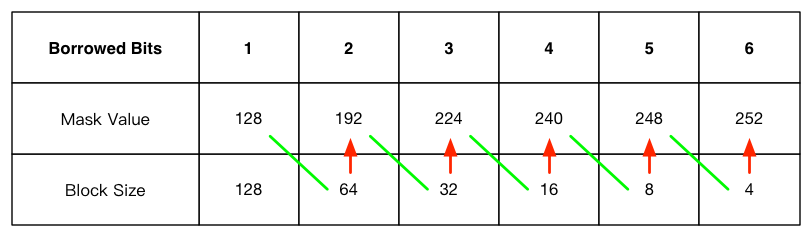

# 子网分割

在[IP地址][ip-address]一文中我们提到了A、B、C三类IP地址，也提到了IP地址中包含了network id和host信息，那么你知道这3类地址分别能够容纳多少台host吗？

以一个C类地址`192.168.1.xxx/24`为例，因为子网掩码的1占用了24位，剩余的0都是用来给host用的——有8位，所以block size = 2 ^ 8 = 256，又因按约定一个block中的第一个值被留作network id（`192.168.1.0`），最后一个值被留作 broadcast addr（`192.168.1.255`），所以实际host的数量 = 256 - 2 = 254。

同理一个B类地址`128.10.xxx.xxx/16`的host数量 = 2 ^ 16 - 2 = 65,534个，一个A类地址`10.xxx.xxx.xxx/8`的host数量 = 2 ^ 24 - 2 = 16,777,214个。

看到问题没有，当你在使用一个A或B类地址的时候会发现host数量太过巨大，那么现实生活中组建如此巨大的网络是不现实的，因此我们需要划分子网。

## 无类型IP编址

给一个有类型IP地址划分子网的方式很简单，在子网掩码中借用后面的0把它们变成1，比如将一个C类地址的子网掩码1的位数变成25：`192.168.1.0/25`，它比C类地址的`/24`多了一个bit，这种形式称为[无类别域间路由][cidr]（CIDR），它的子网掩码就是`255.255.255.128`，这样一来就将原本`192.168.1.0/24`分割成了两个子网。

## 一张计算表

下面这张表列出了借用bit数与分割子网数的关系：

| Borrowed Bits|  1  |  2  |  3  |  4  |  5  |  6  |
|:------------:|:---:|:---:|:---:|:---:|:---:|:---:|
| Mask Value   | 128 | 192 | 224 | 240 | 248 | 252 |
| Subnets      | 2   | 4   | 8   | 16  | 32  | 64  |
| Block size   | 128 | 64  | 32  | 16  | 8   | 4   |
| Hosts        | 126 | 62  | 30  | 14  | 6   | 2   |

为何没有列出借用7、8个bit的情况，因为如果借用7个bit则host数量=0。如果借用8个bit则block size=1，host数量=-1，显然不够用。

如果借用的bit数超过8会怎样，比如一个A类地址`10.10.1.1/8`变成`10.10.1.1/18`会怎样呢？我们吧这个IP地址和子网掩码变成二进制观察一下：

```
IP Addr(dec)     : 10       . 10       . 1        . 1
IP Addr(bin)     : 00001010 . 00001010 . 00000001 . 00000001
subnet mask(bin) : 11111111 . 11111111 . 11000000 . 00000000
subnet mask(dec) : 255      . 255      . 192      . 0
```

可以看到子网掩码的1扩展到了第三个字节且占用了第三个字节的2个bit，因此分割子网数 = 2 ^ 2 = 4，block size = 256 / 4 = 64。

到这里你会发现子网数、block size、host数都比较好算，Mask Value不太好算，下表总结了一个计算方式：将绿色连接的两个数字相加就能够得到红色箭头所指格子里的数字：



## C类地址的子网分割

现在我们来计算一下`192.168.1.0/25`的每个子网的network id、 broadcast addr、block size、host数量、mask value：

* `192.168.1.0/25`被划分为了2个子网，为什么是两个？其实很简单，子网数 = 2 ^ borrowed bits = 2 ^ 1 = 2
* 每个子网block size = 256 / subnets = 256 / 2 = 128
* host数量 = block size - 2 = 128 - 2 = 126

那么每个子网的network id和 broadcast addr是什么呢？其实可以根据block size来计算：

* 第一个子网的network id肯定是0，因此是`192.168.1.0`，因为block size = 128，所以下一个子网network id就是0 + 128 = 128 = `192.168.1.128`。
* 因为每个子网的broadcast addr是其block中的最后一个，因此第一个子网的broadcast addr是后下一个子网的network id - 1 = `192.168.1.127`，因下一个子网是最后一个子网，所以它的 broadcast addr肯定是 255 = `192.168.1.255`。下面是详细表格：
* 去掉每个子网的network id和 broadcast addr，剩下的就是host的范围了

| subnet         | 0    | 128    |
|:--------------:|:----:|:------:|
| first host     | 1    | 129    |
| last host      | 126  | 254    |
| broadcast addr | 127  | 255    |


## A/B类地址的子网分割

前面讲的是如何分割C类地址的子网，因为一个C类地址的前3个字节总是固定的，所以计算network id总是发生在第4个字节上。总结一下，对于A类地址来讲，分割子网的CIDR是`/8+`，B类地址是`/16+`，C类地址是`/24+`。

问题来了，如果对一个A类地址比如`10.10.0.0/18`分割字网，那么该如何计算呢？

在这里我们得先讲一下IP地址“进位”的方式。当你对第n个字节做加法，加到256的时候，则第n个字节清0，第n-1个字节进位，比如我们对`10.10.0.0`的第3个字节不断的加128：

```
10  . 10  . 0   . 0
10  . 10  . 128 . 0
10  . 11  . 0   . 0
10  . 11  . 128 . 0
...
```

这很重要，因为当看到一个CIDR时，我们要知道它的子网掩码延伸到第几个字节，然后在这个字节上不断的加block size，从而得到每个子网的network id，然后计算broadcast addr、host范围等。

举个例子，`10.10.0.0/18`的掩码延伸到了第3个字节，占用了2个bit，block size = 64，所以：

```
subnet1: network id=10.10.0.0    broadcast addr=10.10.63.255
subnet2: network id=10.10.64.0   broadcast addr=10.10.127.255
subnet3: network id=10.10.128.0  broadcast addr=10.10.191.255
subnet4: network id=10.10.192.0  broadcast addr=10.10.255.255
subnet5: network id=10.11.0.0    broadcast addr=10.11.63.255
subnet6: network id=10.11.64.0   broadcast addr=10.11.127.255
...
```

注意看broadcast addr，subnet 1的broadcast addr = subnet 2 network id - 1 = 10.10.64.0 - 1，因为IP地址是一个“进位”系统，所以得到10.10.63.255。

## 变长子网掩码

上面我们已经了解如何进行子网分割，虽然我们避免了IP地址的浪费，但是依然还会有问题。比如一个公司有三个部门，PC数量分别是100台、53台、50台，现在有一个C类地址`192.168.1.0`，我们怎么分割子网呢——要求是每个部门有自己的子网？

如果我们这样`192.168.1.0/25`，则只能分割2个子网，如果`192.168.1.0/26`，能够分割4个子网，但是每个子网的host数量=62，而有一个部门的PC有100台，容纳不了。那该怎么办呢？

这里我们要引入一个工具：变长子网掩码VLSM（Variable Length Subnet Mask），它允许网管可以使用长度不同的子网掩码分割一个网络。

回到上面的例子，我们会这样分割：

```
192.168.1.0   /26
192.168.1.64  /26
192.168.1.128 /25
```

使用VLSM需要很多技巧，本文就不在做详述了。

## 参考资料

* [无类别域间路由][cidr]
* [NetworKing CCNA: IP Address V4 PM][networking-ccna-ipv4-pm]
* [NetworKing CCNA: IP Address V4 LN][networking-ccna-ipv4-ln]

[ip-address]: ip-address.md
[cidr]: https://zh.wikipedia.org/wiki/%E6%97%A0%E7%B1%BB%E5%88%AB%E5%9F%9F%E9%97%B4%E8%B7%AF%E7%94%B1
[networking-ccna-ipv4-pm]: https://www.youtube.com/watch?v=Ct4PU6CyvTQ
[networking-ccna-ipv4-ln]: https://www.youtube.com/watch?v=-e3e9w1GmBw